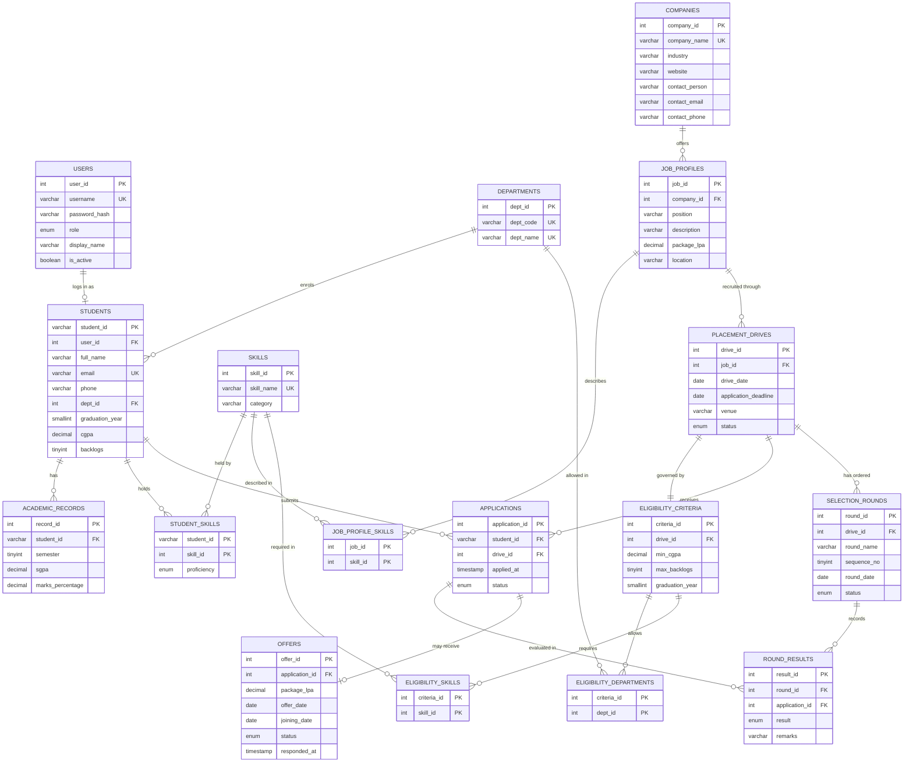

# ER Diagram

Entity–relationship model of the `campus_placement` database. The diagram uses Mermaid notation
(renders on GitHub, GitLab, VS Code with a Mermaid extension, and https://mermaid.live).

## Cardinalities in words

| Relationship | Cardinality | Implementation |
|---|---|---|
| User – Student | 1 : 0..1 | `students.user_id` UNIQUE FK (officers have no student row) |
| Department – Student | 1 : N | `students.dept_id` NOT NULL FK |
| Student – Academic record | 1 : N | FK + UNIQUE (student_id, semester) |
| Student – Skill | M : N | `student_skills` |
| Company – Job profile | 1 : N | `job_profiles.company_id`, UNIQUE (company_id, position) |
| Job profile – Skill | M : N | `job_profile_skills` |
| Job profile – Drive | 1 : N | `placement_drives.job_id` |
| Drive – Eligibility criteria | 1 : 1 | `eligibility_criteria.drive_id` UNIQUE FK |
| Criteria – Department / Skill | M : N | `eligibility_departments`, `eligibility_skills` |
| Student – Drive (application) | M : N | `applications`, UNIQUE (student_id, drive_id) |
| Drive – Selection round | 1 : N | UNIQUE (drive_id, sequence_no) |
| Round – Application (result) | M : N | `round_results`, UNIQUE (round_id, application_id) |
| Application – Offer | 1 : 0..1 | `offers.application_id` UNIQUE FK |
